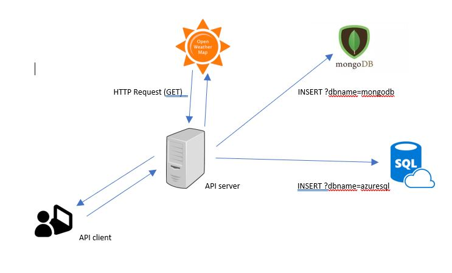

# Creating a RESTful API Service Using MongoDB and Azure :hand: fa18-516-06

| Paul Filliman
| pfillima@iu.edu
| Indiana University
| hid: fa18-516-06
| github: [:cloud:](https://github.com/cloudmesh-community/fa18-516-06/blob/master/paper/paper.md)

---

Keywords: Azure, MongoDB, Swagger, openweathermap

---

## Abstract
For the final project, a RESTful API service was created using weather data through the openweathermap API that retrieves current weather information and stores this information to a persisted data store in either a MongoDB database or an Azure SQL Server database. A user can use this API service in one step to retrieve and store real-time weather data to a personal persisted storage connection.

The goals for this project are to gain experience with creating a RESTful API and use sample data retrieved from a public API to use with MongoDB database as well as as with a relational Azure SQL database.

## Introduction

For this project, we create a REST API service using a swagger yaml file to define our service, server side components to implement the service, creation of a cloud-based MongoDB database using MongoDB Atlas, creation of an Azure SQL Database, and a client side component to call the service through a web URL call.

## Design

## Architecture
swagger, flask, openweathermap api, MongoDB Atlas, AZure SQL Database

## Implementation
1. install from requirements.txt
2. create yaml for openweathermap api retrieval
3. create server.py using yaml
4. implement weatherapi.py for GET/POST
5. Makefile

## Technologies Used
swagger, flask, openweathermap api, MongoDB Atlas on AWS, Azure SQL Database

## Results

## Deployment Benchmarks

## Application Benchmarks

## (Limitations)

## Conclusion

## (Work Breakdown)

