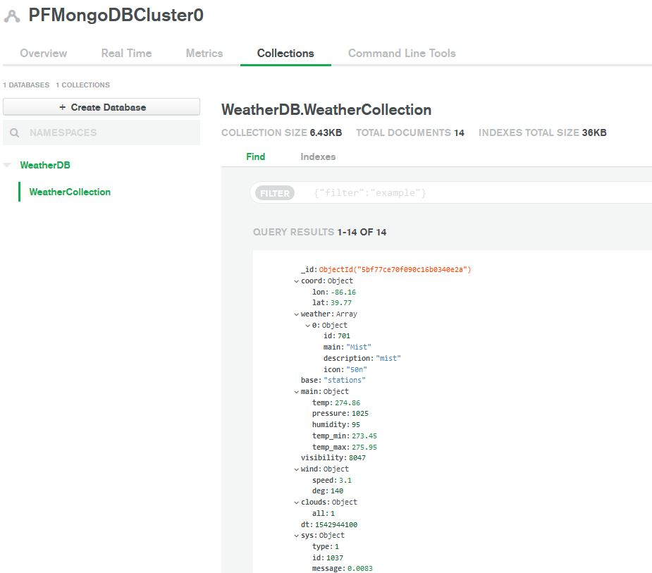
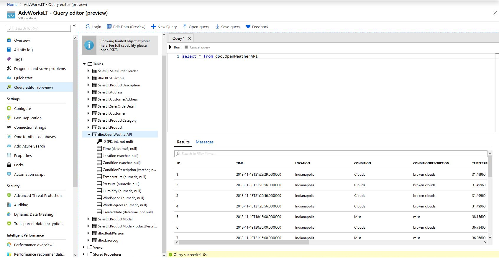
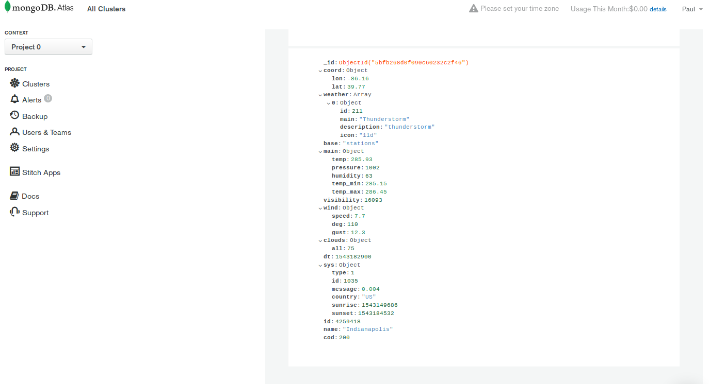

# Creating a RESTful API Service Using MongoDB and Azure SQL Database :smiley: fa18-516-06

| Paul Filliman
| pfillima@iu.edu
| Indiana University
| hid: fa18-516-06
| github: [:cloud:](https://github.com/cloudmesh-community/fa18-516-06/blob/master/project-paper/report.md)


**:mortar_board: Learning Objectives**

* Create a first REST API
* Retrieve data from a public API
* Use MongoDB and Azure SQL as DBaaS

---

Keywords: Azure SQL, MongoDB, Atlas, Swagger, OpenWeatherMap, REST, DBaaS

---

## Abstract
For the final project, a RESTful API service was created using weather data through the OpenWeatherMap API that retrieves current weather information and stores this information to a persisted data store in either a MongoDB Atlas database or a Microsoft Azure SQL Server database. A user can use this API service in one step to retrieve and store real-time weather data to a personal persisted storage connection.

The goals for this project are to gain experience with creating a RESTful API and use sample data retrieved from a public API to use with MongoDB database as well as as with a relational Azure SQL database.


## Introduction

For this project, we create a REST API service using a swagger yaml file to define our service, server side components to implement the service, creation of a cloud-based MongoDB database using MongoDB Atlas, creation of an Azure SQL Database, and a client side component to call the service through a web URL call.

The data used in this project is current weather data from the public API OpenWeatherMap. Using weather data is simple for the users to understand and provide a real-time data source. The yaml file is structured to retrieve data from the OpenWeatherMap API and the server components use this data to insert into either a MongoDB or an Azure SQL persisted data store. The client user can specify connection strings to their own MongoDB and Azure SQL databases and specify through a URL which data store to which they can persist the data. The user can setup this service to run consistently to insert real-time weather data into their database. Once the user uses this API service to perist data, the user can use this data in analysis.


## Design

The outcome for this project is to build a REST API and have a client user call this API through a URL and have real-time data inserted into either a cloud-based MongoDB database or a cloud-based Azure SQL database. The user will also see the results in a JSON format of the data being inserted into either of the persisted data stores.

As seen in Figure 1, this project can be separated into the client resources and the API server resources. The API server is central to this project. Within the API server components, we have three source files, a Swagger 2.0 yaml file used to outline the sample weather data pull, a server source file in Python to outline the GET/POST routines, and a secondary Python source file to implement the GET/POST routines.

On the API client side, we need to setup a MongoDB database cluster using the cloud-based MongoDB Atlas. We need to create a MongoDB database within this cluster and a collection within the database. We also need to setup an Azure SQL Database server, a database, and construct a table creation script to insert the sample data. The client will store connection credentials for these database servers into a config file.

The outcome will be for the client to send an HTTP request to the API server and to have the real-time data inserted into either MongoDB or Azure SQL using a URL parameter specifier.


## Architecture

The architecture diagram for this project is shown in Figure 1. 

{#fig:This figure shows the project architecture diagram.}


The architecture is separated into five components.

#### API Server

The API server is built using swagger 2.0 The swagger.yaml file identifies which attributes of the weather data that will be received from the OpenWeatherMap API. The swagger.yaml file is used by the server.py source file which outlines the HTTP CRUD method requests. Additionally, a secondary source file, weatherapi.py details the methods used when calling the HTTP requests, parsing the parameters out of the client URL request, parsing the connection information to the databases from a config file, transforming raw weather data into decoded information, and determining the proper persisted data store.


#### API Client

The client uses a simple URL request in the format *http://localhost:5000/weather?dbname?mongodb* or *http://localhost:5000/weather?azuresql>* to retrieve information from the REST service. We are using localhost port 5000 in this project. The client will also need to provide connection information in a configuration file to the MongoDB and or Azure SQL databases to store information in their database(s). 


#### MongoDB Database

The MongoDB database used in this project is the cloud-based MongoDB Atlas database. First a cluster needs to be setup by the user as well as a database in that cluster and a collection in that database to store the non-relational data from the REST service. The cluster used in this project is a free tier MongoDB Atlas M0 Instance cluster using version 4.0.4 on an AWS server. This cluster can provide up to 512 megabytes free data storage which will be within the limitations for this project fa18-516-06-MongoDB1.

{#fig:This figure shows the MongoDB DBaaS Interface.}


#### Azure SQL Database

Similar to creating the cloud-based MongoDB database, an Azure SQL Database can be used. For this project, a Basic DTU-based pricing tier Azure SQL Server database server is used. The Basic pricing tier has a max total data size of 2 gigabytes and is under 5 USD per month [fa18-516-06-AzureSQL1]. Once a database server is created, we need to create a database and a table to store the data. Within the table, we need to define type specific columns for character and numeric fields and also provide metadata columns for a primary key and creation dates.


{#fig:This figure shows the Azure SQL Server DBaaS Interface.}


#### OpenWeatherMap API

The OpenWeatherMap public API is where we retrieve our current weather data. The format used to retrieve this is *http://api.openweathermap.org/data/2.5/weather?q=mycityname&appid=myappkey* [fa18-516-06-OpenWeatherMap1]. Again, For this project, there is a free or minimal cost subscription is used. With the free OpenWeatherMap subscription we can retrieve sixty or fewer api calls per minute [fa18-516-06-OpenWeatherMap2].


## Implementation

The implementation to accomplish this project is broken up into source files in the following directories.

1. **/project-code/Makefile**
   This is the Makefile that is used to install the project Python requirement packages.

2. **/project-code/requirements.txt**
3. **/project-code/packages.txt**
   The requirements.txt and the packages.txt files contain the Python packages needed to be installed prior to executing the project on a Linux Ubuntu 16.04 operating system.

4. **/project-code/etc/cloudmesh-weather.yaml**
   This yaml file contains the connection information attributes for connecting to the MongoDB Atlas cloud database and the Azure SQL cloud Database.

5. **/project-code/services/weather.yaml**
   This yaml file contains the structure of the data that will be retrieved from the OpenWeatherMap API service and is one of the main source files in this project. This yaml file does many things. First, it uses the swagger version 2.0 and maps the data retrieved to work with our REST API data structure. Secondly, this file contains the parameters for the client URL, for example the database type where the retrieved information will be persisted. Thirdly, this file references the operation identifier method that will be used to interface the retrieved information with the project API.

6. **/project-code/weather/server.py**
   The server file is the central part of this project. The server.py source file uses the Python package connexion and references weather.yaml in the creation of the connexion app api. This file is the parent file which needs to be run first before all client tasks can run successfully.

7. **/project-code/weather/weatherapi.py**
   This file is the largest source file and contains all of the detailed tasks that does many things including parsing security information from the connection file cloudmesh-weather.yaml, retrieves and transforms raw weather API data, creates an Azure SQL database table for inserts, parses the raw JSON data into separate columns, creates connection strings for Azure SQL and MongoDB, parses URL parameters for database type, and finally inserts into a MongoDB collection or an Azure SQL Database table.


## Steps to Reproduce

The following are the steps to reproduce this project running on a Linux Ubuntu 16.04 Operating System using Python version 3.7.1.

1. Using the Makefile under /project-code, install the requirements using the command *make install*.

```python

> cd cloudmesh/fa18-516-06/project-code
> make install

```

2. If needing to use a separate connection for MongoDB or for Azure SQL Database other than the default connections, edit the *cloudmesh-weather.yaml* file under /project-code/etc/.

3. Under the directory /project-code/weather, execute the source file *server.py* with the command *python server.py*

```python

> cd weather
> python server.py

```

4. Run the client side opening a web browser with the URL *http://127.0.0.1:5000/weather*. From here we can see that the server side piece is running by seeing the current weather data in JSON format.

5. To insert data into the MongoDB specified in step 2, run the URL *http://127.0.0.1:5000/weather?dbname=mongodb*. After running this, we see the JSON data as we did in step 4, but also this has been inserted into our database and collection in MongoDB.

6. To insert data into the specified Azure SQL Database, run the URL *http://127.0.0.1:5000/weather?dbname=azuresql*. We see the weather information in the web browser as well as the subsequent insert into the Azure SQL database.


## Technologies Used

There were many technologies used in this project. The source code was created using Python version 3 with multiple packages including flask, flask_restful, connexion, and pyodbc. There were two database as a service (DBaaS) services used, MongoDB Atlas and Microsoft Azure SQL Server. Finally, a REST service was used from OpenWeatherMap to import data into our REST service.

This project encompassed many different technologies working together. With our REST service at the center as shown in the architecture diagram, Figure 1, we take input from the client URL, retrieve API data from OpenWeatherMap, and import into one of two DBaaS.


## Results

Upon running the steps outlined above in Steps to Reproduce, there are two outcomes to test.

**Insert data into MongoDB**

With this first test, we want to see a JSON formatted file inserted into our MongoDB collection upon entering the URL *http://127.0.0.1:5000/weather?dbname=mongodb* from a client web browser.

**Client**


{#fig:This figure shows the URL using the parameter dbname=mongodb to insert into a collection in our MongoDB instance.}


**MongoDB Result**


{#fig:This figure shows results inserted into MongoDB using a URL parameter.}


We can see from figure 3 and figure 4 that the file returned in the result was committed to the MongoDB database.


**Insert data into Azure SQL Database**

With this second test, we again want to see the JSON formatted file inserted into our Azure SQL Server Database table upon entering the URL *http://127.0.0.1:5000/weather?dbname=azuresql* from a client web browser.

**Client**


{#fig:This figure shows the URL using the parameter dbname=azuresql to insert into a table in our Azure SQL Database instance.}


**Azure SQL Database Result**


{#fig:This figure shows results inserted into Azure SQL Database using a URL parameter.}


We can see from figure 5 and figure 6 that the file returned in the result was committed as a row into the prior specified Azure SQL Server database table.

We see from these results that our REST API is working, retrieving real-time weather data through a web API and inserting these rows into either a MongoDB database or a Microsoft Azure SQL Server database.


## Conclusion

The goal and outcome for this project is to gain familiarity and experience in creating a RESTful API and use sample data retrieved from a public API to use with MongoDB database as well as as with a relational Azure SQL database. To get from input to output, there were several technologies that were used and these separate technologies were needed to communicate with each other.

There are many ways to enhance this REST service created with this project. For example, multiple cities data can be used, or create a city as a new URL parameter. We can also automate this process to retrieve data every few seconds or every few minutes. Other technologies can be used with larger amounts of streaming data including Spark, Azure Databricks, and Azure Streaming Analytics. These technologies are higher cost options which could be used in corporate environments.

